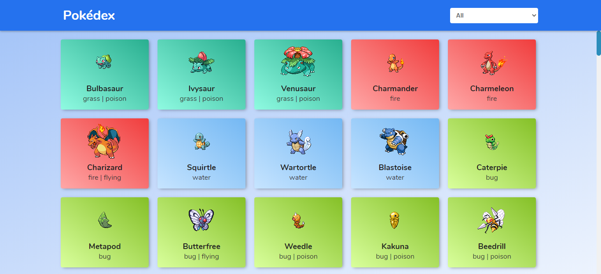

<div align="center">
  <h2>Pokédex</h2>

  <a href="https://www.linkedin.com/in/higordenomar/">
      
   </a>
  
  <a href="https://twitter.com/higordenomar">
    
  </a>

  <a href="mailto:higordenomar@hotmail.com">
    
  </a>
  
  <a href="https://github.com/HigorDenomar/pokedex/blob/master/LICENSE">
    
  </a>

</div>

<br />&nbsp;

<p align="center">
  <a href="#prints">Screenshot</a>&nbsp;&nbsp;&nbsp;|&nbsp;&nbsp;&nbsp;
  <a href="#techs">Technologies</a>&nbsp;&nbsp;&nbsp;|&nbsp;&nbsp;&nbsp;
  <a href="#running">Running locally</a>
</p>

<br />&nbsp;

<h2 id="prints">📷 Screenshot</h2>



<br />&nbsp;

<h2 id="techs">🔭 Technologies</h2>

- Javascript
- [Sass](https://sass-lang.com/)
- CSS3
- HTML5

<br />&nbsp;

<h2 id="running">💻 Running locally</h2>

From your command line:

```sh
# download the repository
> git clone https://github.com/HigorDenomar/pokedex.git
```